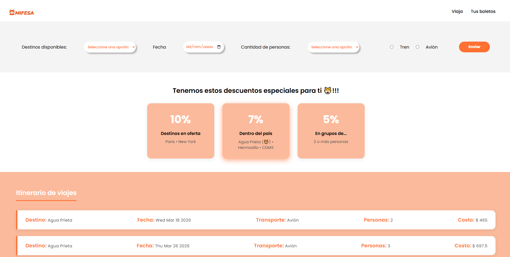
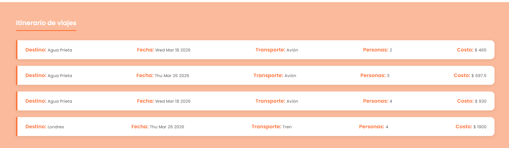
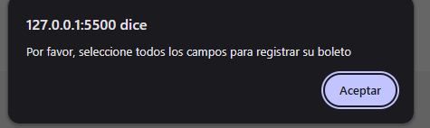

# Lección 1 - Introducción a ECMAScript: Planificador de viajes
En la práctica de esta lección se verá un planificador de viajes aplicando conceptos de ECMAScript


## Archivos del repositorio

- **./index.html**: Archivo HTML del proyecto, conectando el script.js y el style.css

- **./style.css**: Archivo CSS con los estilos aplicados al sitio web

- **./script/app.js**: Archivo JS que contiene la en implementación como tal
- **./script/viajes.js**: Archivo JS que contiene el proceso tanto de registrar un destino, mostrarlo, calcular descuentos o precios


- **img/Captura1.png**: Captura de pantalla inicial
- **img/Captura2.png**: Captura de pantalla de viajes registrados
- **img/Captura3.png**: Captura de pantalla de error en caso que algún campo no esté seleccionado

- **./notas-clase**: Directorio con archivos de temas vistos en clase

- **./ejercicio-clase**: Directorio con el reto propuesto en clase con un intento resuelto por mi qwq

- **./img**: Directorio con archivos de capturas y logo


## Aprendizajes:
- Aplicar conceptos de ECMAScript
- Reforzar elementos vistos anteriormente como el uso de objetos, recorrido del mismo, obtención de datos de un formulario, validación de datos
- Formateo de fechas


## Evidencia visual

A continuación se muestra una captura de pantalla del código funcionando en la consola del navegador:






## Ejemplo de uso

Abra el archivo 
```./index.html```
en su navegador y revise el sitio web para probar la funcionalidad del mismo

También puede mirar el código de JavaScript abriendo el archivo
```./script/app.js```
```./script/viajes.js```
dentro de su editor de código preferido o dentro de Github.

## Despliegue

Se desplegó en Github Pages a partir de este repositorio, puedes ver la página a través del siguiente link:

https://mor4n.github.io/logica-y-algoritmos-02/01-intro-ecmascript/index.html

## Como conclusión personal:

En esta práctica pude tanto reforzar conocimientos como de objetos al quitar los ifs, como de ECMAScript al reescribir el código como lo planteaba, de localstorage, de inserción de datos en la página con innerHTML, de formularios como el uso de input radio. 
Traté de usar todos los elementos que pudiera de lo que hemos estado aprendiendo y hubo bastantes trabas que tuve q-q por ejemplo para usar el select, en cierto punto se me olvidó un poco como era el recorrido de un objeto (que al final era con for in), y otras cosas un poco más específicas, como el hacer que la primera opción estuviera deshabilitada, el obtener un dato de un select, el formatear una fecha tuve que ver un vídeo porque no pude entender bien como hacerlo con la documentación.
Fue una práctica que sentí bastante integradora ;w; aunque el diseño no me haya quedado bonito, siento que aprendí demasiado en cuanto a que puedo hacer para crear más interactividad del sitio y hacer así sitios más completos


## Fuentes:
https://developer.mozilla.org/es/docs/Web/HTML/Reference/Elements/select
https://www.w3schools.com/tags/tryit.asp?filename=tryhtml5_input_type_radio
https://developer.mozilla.org/es/docs/Web/JavaScript/Reference/Statements/for...in
https://stackoverflow.com/questions/22033922/how-to-show-disabled-html-select-option-by-default
https://www.w3schools.com/jsref/tryit.asp?filename=tryjsref_select_value
https://www.youtube.com/watch?v=s5OEuGoQRBI
https://stackoverflow.com/questions/15839169/how-to-get-the-value-of-a-selected-radio-button