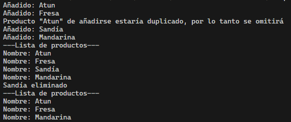
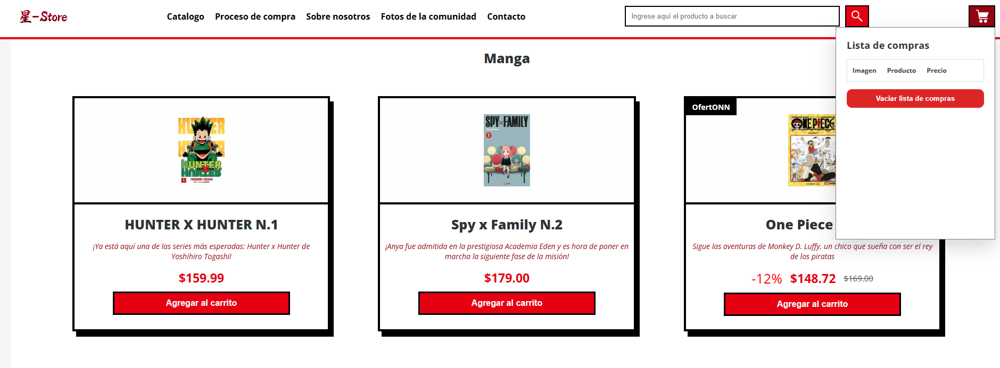
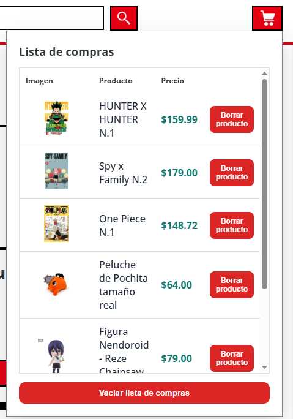
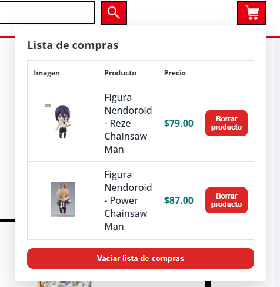
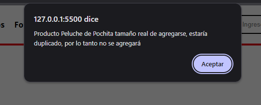

# Lección  2 - Proyecto Estructuras de Datos : 

En este proyecto se realizó una lista de compras por consola y se aplicó el ejercicio en un carrito de compras del proyecto final del módulo 2

## Archivos del repositorio

- **./index.html**: Archivo HTML del proyecto, conectando el carrito.js y el style.css

- **./style.css**: Archivo css para los estilos del proyecto

- **./script/app.js**: Archivo javascript con el ejercicio de la lección realizada en consola

- **./script/carrito.js**: Archivo javascript con la implementación de carrito de compras en base al ejercicio realizado


- **./capturas/**: Directorio que almacena todas las capturas de pantalla para el readme
- **./ejercicio-clase/**: Directorio que almacena el ejercicio realizado en clase
- **./img/**: Directorio que almacena todas las imagenes para el sitio web
- **./notas-clase/**: Directorio que almacena las notas de la clase

- **./capturas/Captura1.png**: Captura de pantalla del ejercicio en terminal
- **./capturas/Captura2.png**: Captura de página web con el script implementado
- **./capturas/Captura3.png**: Captura de página web con productos añadidos
- **./capturas/Captura4.png**: Captura de página web con productos borrados, dejando solo 2
- **./capturas/Captura5.png**: Captura de página web evitando duplicados


## Aprendizajes:

- Aplicar metodos de arreglos como filter, some, push en la implementación de una lista de compras


## Evidencia visual

A continuación se muestra una captura de pantalla del código funcionando en la consola del navegador:








## Ejemplo de uso

Abra el archivo 
```./index.html```
en su navegador y revise el sitio web para probar la funcionalidad del mismo

También puede mirar el código de JavaScript abriendo el archivo 
```./script/app.js  para el archivo de lo que se pide en el ejercicio```

```./script/carrito.js  para el archivo de la implementación como carrito```
dentro de su editor de código preferido o dentro de Github.

## Despliegue

Se desplegó en Github Pages a partir de este repositorio, puedes ver la página a través del siguiente link:

https://mor4n.github.io/logica-y-algoritmos-02/02-estructuras-de-datos/index.html


## Como conclusión personal:

En esta lección pude aprender a crear una lista de compras, que lo intenté aplicar en el sitio web que había hecho para proyecto final de módulo 2 para asi complementarlo.

Hubo bastantes partes donde me trabé al querer implementar el ejercicio en la página web y hubo también bastantes cosas que encontré.

Es por ejemplo esto de a cada tarjeta de producto (y de botón de elimnar producto en el carrito) añadirle un event listener que escuche si al elemento al que le diste clic fue un botón en especifico, en ese caso que se le pase por una función de extracción el contenido de esta tarjeta, pero como nosotros le dimos clic a un botón, que este vaya un poquito para atrás, un nodo anterior, para que le pase la tarjeta, y eso es una cosa que habíamos visto en clase pero nunca pensé que se pudiera aplicar de esa forma.

En la función de extracción se extraerían los datos por medio del textcontent y el id del producto que está como data-id dentro del botón (que esto es algo que quise implementar anteriormente pero nunca supe como hasta ahora), una vez extraído los datos se mandarían a una función que añadiría el producto, pero para esto, se verificaría mediante un some si existe el producto en base a su nombre y se haría una condición de si está el producto en el arreglo, solo se manda una alerta, en caso de que no esté, se añade el producto a la lista y se manda a llamar otra función que añade de forma visual en la tabla de productos el producto añadido.

Por otro lado, para eliminar igual que el de añadir producto, donde busco si se presionó un botón que tenga una clase en especifico, de ser así, usé un filter, en donde todo lo que no sea coincidente con el id del producto que se quiere eliminar, quiero que lo pase en el mismo arreglo, así sacó el producto a eliminar del arreglo y vuelvo a mostrar la lista.

Me encantó esta práctica porque siento que a pesar de que me trabé mucho, en base de prueba y error y buscar, pude en cierto punto complementar una práctica final y hacerla un poquito más interactiva y algo tal vez en una de esas que se puede aplicar en el mundo real :'D!


## Fuentes:

https://www.w3schools.com/jsref/jsref_reduce.asp
https://www.w3schools.com/jsref/jsref_some.asp
https://developer.mozilla.org/es/docs/Web/JavaScript/Reference/Global_Objects/Array/sort
