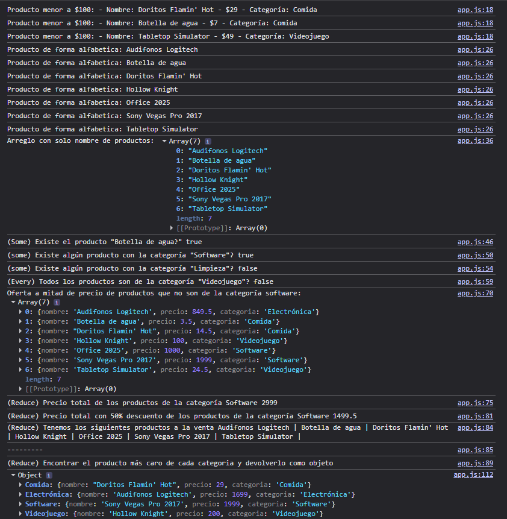

# Lección  3 - Proyecto Métodos de Arreglos: Filtro y Orden de Productos de una Tienda Online.

En este proyecto se usarán métodos de arreglos como find, map, filter, foreach, sort, reduce, some, every.


## Archivos del repositorio

- **./index.html**: Archivo HTML del proyecto, conectando el script.js 

_ **./script/app.js**: Archivo de Javascript con la práctica realizada para este proyecto en consola

- **./reto-semana/reto.js**: Archivo de Javascript con el reto de la semana realizado


- **./capturas/Captura1.png**: Captura de pantalla con los ejercicios resueltos

- **./notas-clase/**: Directorio con notas realizadas de clase

- **./reto-semana/**: Directorio con el reto de la semana realizado


## Aprendizajes:

- Se aprendió el uso de distintos métodos que tienen los arreglos y el como poder incluso aplicarlo con objetos dentro de arreglos


## Evidencia visual

A continuación se muestra una captura de pantalla del código funcionando en la consola del navegador:




## Ejemplo de uso

Abra el archivo 
```./practica-leccion/index.html```
en su navegador y revise el sitio web para probar la funcionalidad del mismo

También puede mirar el código de JavaScript abriendo el archivo
```./script/app.js```

```./reto-semana/reto.js```

dentro de su editor de código preferido o dentro de Github.

## Despliegue

Se desplegó en Github Pages a partir de este repositorio, puedes ver la página a través del siguiente link:

https://mor4n.github.io/logica-y-algoritmos-02/03-metodos-de-arreglos/practica-leccion/index.html


## Como conclusión personal:

Esta siento que ha sido una de las lecciones de más aprendizaje y más dificiles que he tenido hasta ahora, más que nada por el reduce y el map, como el ejercicio final que nos puso y el ejercicio final de reduce que traté de hacer, las cuales se me hicieron bastante complicadas JAJAJA

Con esto me di cuenta "tal vez no sé muy bien como hacerlo", siendo sincero, me llegué a confundir demasiado, y en estos dos casos puntuales que voy a mencionar a continuación, le tengo que ser sincero, tuve que apoyarme de la inteligencia artificial (perdón 😿) 
Cuando me daba la respuesta y veía entre lo que quería hacer y la respuesta decía "aaah con que así era" JDSKJSA

En las partes donde me trabé fueron estas 2, que parecen pocas pero fueron la base del ejercicio:

- (!(producto.categoria in totalProductos)) <- No recordaba y no sabía como buscar la clave, le estaba haciendo al inicio totalProductos.categoria pero nunca fue asi JAJAJA 

- totalProductos[producto.categoria] = producto; <- No recordaba bien como era para que tuviera el nombre de la categoria (que es con [producto.categoria])

y el extra fue que me OLVIDABA MUCHO AL FINAL Y NO SÉ POR QUÉ, que siempre tengo que poner un return, tuve al final algunos undefined y siempre fue por eso (más que nada fue porque al no usarla explicitamente al usar una sola línea en el callback, se me pasó al momento de querer usarla en {} )

Muchas gracias de verdad por la enseñanza, voy a tratar de hacer más ejercicios como el que nos puso al final de la clase para intentar dominarlo todo lo posible!, mil mil gracias!

## Fuentes:

https://www.youtube.com/watch?v=UxrSeTSI8z0

https://www.w3schools.com/jsref/jsref_reduce.asp
https://www.w3schools.com/jsref/jsref_some.asp
https://developer.mozilla.org/es/docs/Web/JavaScript/Reference/Global_Objects/Array/sort