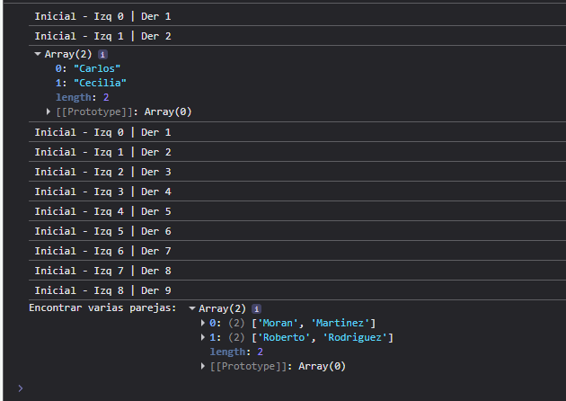
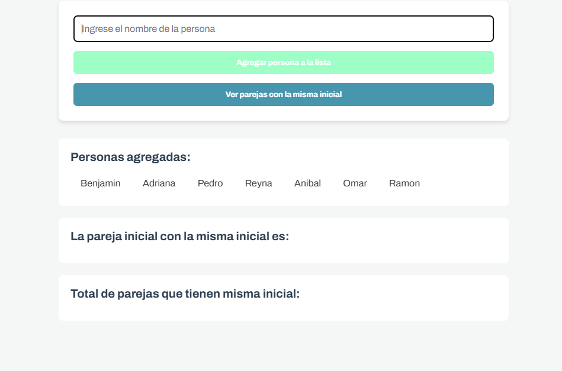
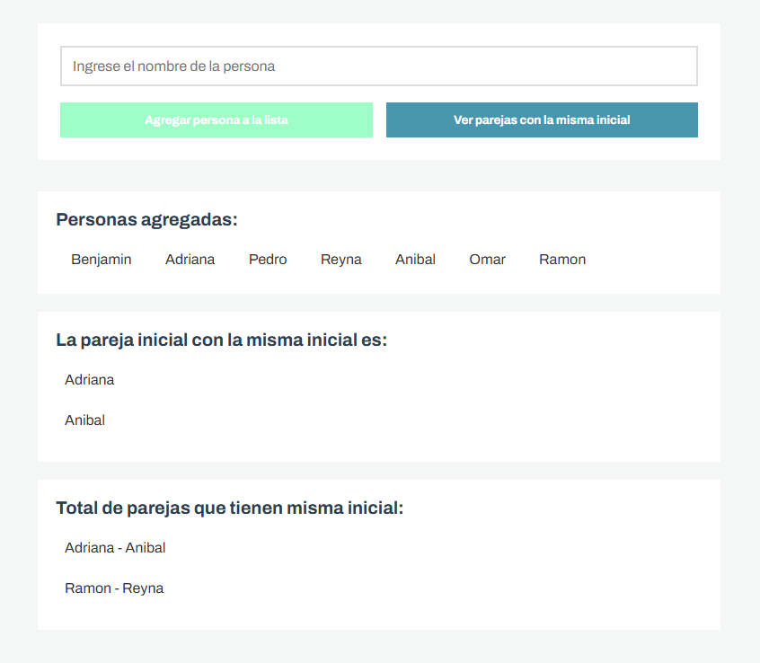

# Lección 04: Algoritmo de Los 2 Punteros - Encuentra los Invitados que Pueden Sentarse Juntos: 


## Archivos del repositorio

- **./practica-leccion/index.html**: Archivo HTML del proyecto, conectando el script.js 

- **./practica-leccion/style.css**: Archivo CSS del proyecto, conteniendo los estilos del proyecto

- **./practica-leccion/script/app.js**: Archivo de Javascript con la práctica realizada para este proyecto, tanto en consola como con interfaz con el HTML.


- **./capturas/Captura1.png**: Captura de pantalla con el ejercicio en consola
- **./capturas/Captura2.png**: Captura de pantalla del HTML con personas añadidas
- **./capturas/Captura3.png**: Captura de pantalla con el resultado de las parejas que se pueden sentar juntos

- **./notas-clase/**: Directorio con notas realizadas de clase


## Aprendizajes:

- Pude aprender a implementar el algoritmo de dos punteros en cierto punto, en base al gist que habían dejado


## Evidencia visual

A continuación se muestra una captura de pantalla del código funcionando en la consola del navegador:






## Ejemplo de uso

Abra el archivo 
```./practica-leccion/index.html```
en su navegador y revise el sitio web para probar la funcionalidad del mismo

También puede mirar el código de JavaScript abriendo el archivo
```./practica-leccion/script/app.js```
dentro de su editor de código preferido o dentro de Github.

## Despliegue

Se desplegó en Github Pages a partir de este repositorio, puedes ver la página a través del siguiente link:
https://mor4n.github.io/logica-y-algoritmos-02/04-algoritmo-de-dos-punteros/practica-leccion/index.html


## Como conclusión personal:
En esta lección pude aprender sobre el algoritmo de dos punteros, a decir verdad, siento que es un algoritmo muy útil, incluso me llamó la atención que en el campus, uno de los ejemplos haya sido el de encontrar la suma de dos elementos, siendo este uno de los primeros ejercicios que se encuentra en Leetcode a lo que tengo entendido.
Para resolver el ejercicio de esta lección, me apoyé en el gist, implementando los elementos que faltaban, aparte, hice otra función para que no sólo diera la primera pareja, sino que diera todos los demás, esto guardandolo en otro arreglo cada pareja.
También, por otro lado, para añadir lo que hemos estado viendo en el módulo pasado, intenté hacer el ejercicio aparte en conjunto con el HTML, para así que pudiera ser un poco más dinámico, pudiendo añadir nombres en el input de la página HTML, los cuales se guardarán en un arreglo, estos nombres que se añadan pueden ser desordenados (en el sentido de que puede ser con iniciales revueltas, como "Martinez, Alejandro, Pedro"), ya cuando la persona dé clic en el botón de ver parejas, antes de mandar el arreglo a las funciones para encontrar la pareja, se hizo un sort para ordenarlos alfabeticamente, ya que el algoritmo a lo que tengo entendido, funciona teniendo los elementos ordenados (tipo de menor a mayor por ejemplo), y con eso pude hacer esta parte final ;u;


## Fuentes:

https://www.freecodecamp.org/news/javascript-check-empty-string-checking-null-or-empty-in-js/