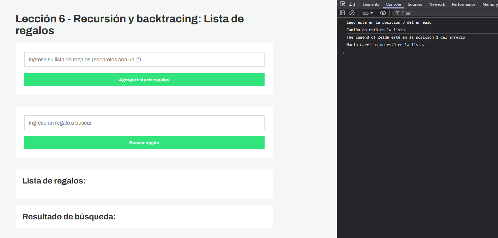
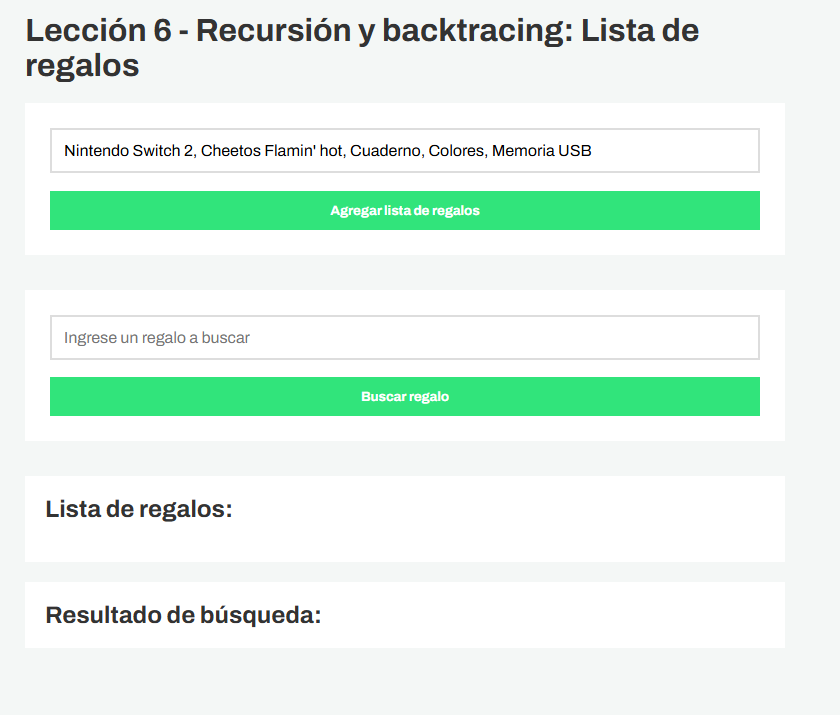
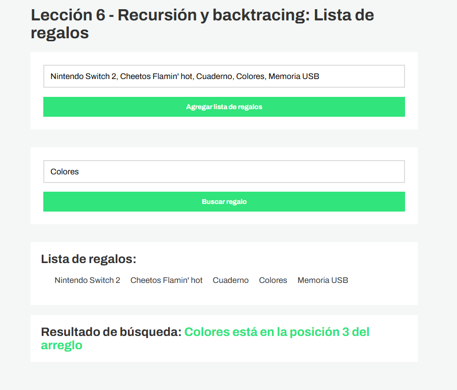
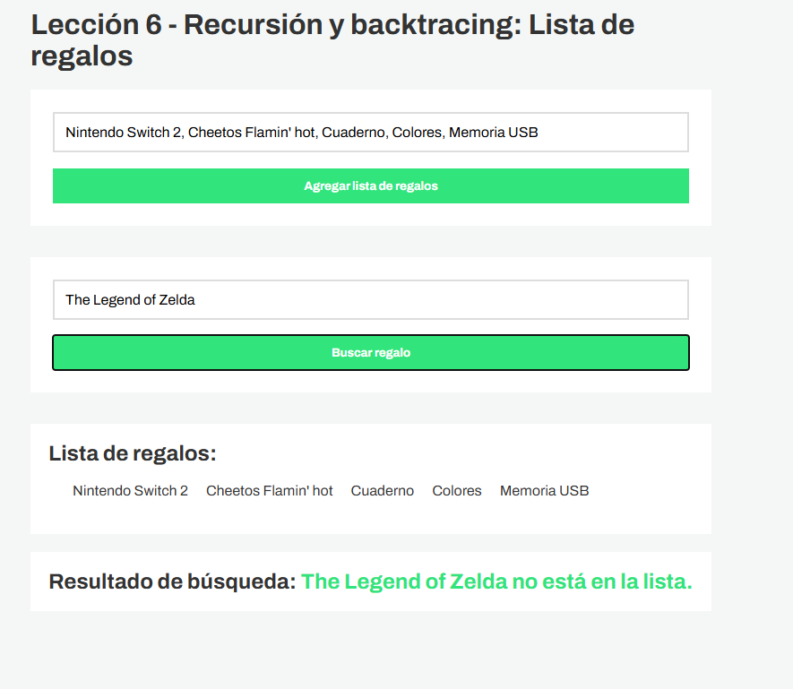

# Lección  6 - Recursión y Backtracing : Lista de regalos


## Archivos del repositorio

- **./practica-leccion/index.html**: Archivo HTML del proyecto, conectando el script.js 

- **./practica-leccion/style.css**: Archivo CSS del proyecto, conteniendo los estilos del proyecto

- **./practica-leccion/script/app.js**: Archivo de Javascript con la práctica realizada para este proyecto, tanto en consola como con interfaz con el HTML.


- **./capturas/Captura1.png**: Captura de pantalla de HTML junto con el resultado del ejercicio en consola
- **./capturas/Captura2.png**: Captura de pantalla de datos colocados en el input
- **./capturas/Captura3.png**: Captura de pantalla de datos añadidos al arreglo de regalos y mostrados en pantalla
- **./capturas/Captura4.png**: Captura de pantalla de búsqueda de un dato en el arreglo usando recursión
- **./capturas/Captura5.png**: Captura de pantalla de búsqueda de un dato que no existe en el arreglo


## Aprendizajes:

- Pude aprender y prácticar el uso de la recursión y backtracing


## Evidencia visual

A continuación se muestra una captura de pantalla del código funcionando en la consola del navegador:








## Ejemplo de uso

Abra el archivo 
```./practica-leccion/index.html```
en su navegador y revise el sitio web para probar la funcionalidad del mismo

También puede mirar el código de JavaScript abriendo el archivo
```./practica-leccion/script/app.js```
dentro de su editor de código preferido o dentro de Github.

## Despliegue

Se desplegó en Github Pages a partir de este repositorio, puedes ver la página a través del siguiente link:
https://mor4n.github.io/logica-y-algoritmos-02/06-recursion-y-backtracing/practica-leccion/index.html


## Como conclusión personal:

En esta lección pude aprender sobre la recursión y el backtracing, en cuanto a la recursión, recuerdo que llegué a ver sobre ello en una materia, solo que nunca lo había llegado a entender como en la clase de hoy, nunca había tenido en cuenta sobre los casos base, solo sabía que era llamarse a sí mismo y es algo demasiado valioso de saber, porque tengo entendido que otros algoritmos u ejercicios de leetcode se basan o se puede aplicar recursión, me parece que por ejemplo en los árboles se puede aplicar ;u; , voy a tratar de seguir practicando por mi cuenta para intentar en un futuro, aplicarlo a algún ejercicio de programación de leetcode :'D! muchas gracias por la clase!

