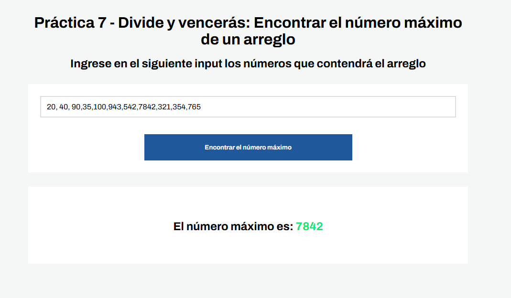

# Lección  7 - Divide y vencerás: Búsqueda del Máximo en un Arreglo con Divide and Conquer


## Archivos del repositorio

- **./practica-leccion/index.html**: Archivo HTML del proyecto, conectando el script.js 

- **./practica-leccion/style.css**: Archivo CSS del proyecto, conteniendo los estilos del proyecto

- **./practica-leccion/script/app.js**: Archivo de Javascript con la práctica realizada para este proyecto, tanto en consola como con interfaz con el HTML.


- **./capturas/Captura1.png**: Captura de pantalla de HTML junto con el resultado del ejercicio en consola
- **./capturas/Captura2.png**: Captura de pantalla del HTML con el resultado del número máximo de un arreglo


## Aprendizajes:

- Aprendí sobre de divide y vencerás, así como la aplicación práctica en este mini-ejercicio


## Evidencia visual

A continuación se muestra una captura de pantalla del código funcionando en la consola del navegador:





## Ejemplo de uso

Abra el archivo 
```./practica-leccion/index.html```
en su navegador y revise el sitio web para probar la funcionalidad del mismo

También puede mirar el código de JavaScript abriendo el archivo
```./practica-leccion/script/app.js```
dentro de su editor de código preferido o dentro de Github.

## Despliegue

Se desplegó en Github Pages a partir de este repositorio, puedes ver la página a través del siguiente link:
https://mor4n.github.io/logica-y-algoritmos-02/07-divide-y-venceras/practica-leccion/index.html


## Como conclusión personal:

En esta práctica pude aprender sobre el paradigma de divide y vencerás, realmente recuerdo haberlo visto anteriormente en otros lados, pero no sabía que se podía aplicar de esta forma, en el sentido de hacer las cosas más pequeñas y luego hacer recursividad! Fue súper interesante de aprender :'D en este caso, llegué a tener cierto error, ya que al momento de hacer el map del arreglo, tenía que convertir los elementos en lugar de string a númericos, ya que estuve probando con números mediante el input y a veces no me daba el resultado que esperaba, por ello, los convertí a númericos tipo flotante con parseFloat y con esto creo que pudo funcionar ya correctamente el programa :'D!