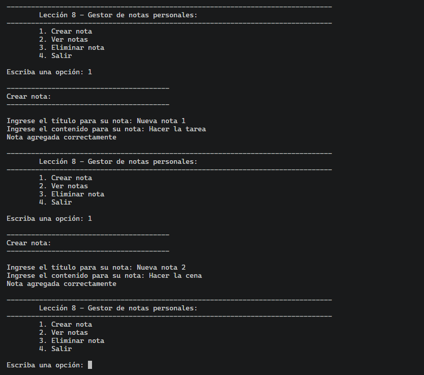
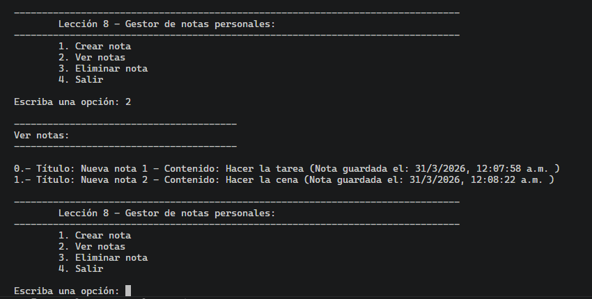
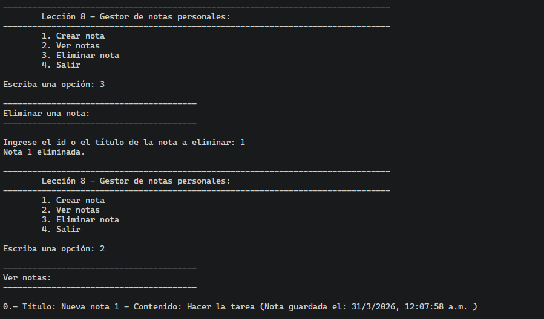
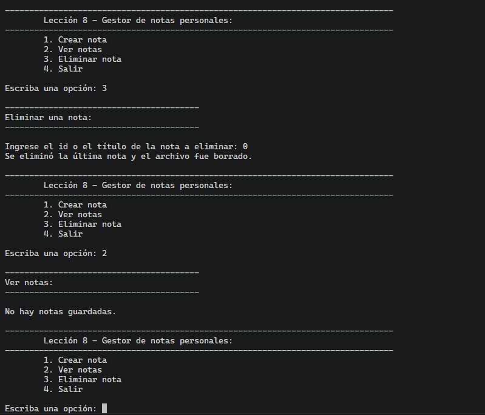
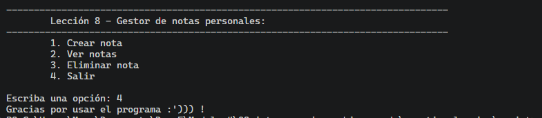

# Lección 8 - Introducción al manejo de archivos con node: 


## Archivos del repositorio


- **./practica-leccion/gestorNotas.js**: Archivo de Javascript con la práctica realizada para este proyecto final

- **./ejemplos/**: Directorio con ejemplos del campus

- **./notas-clase/**: Directorio con ejemplos vistos en clase


- **./capturas/Captura1.png**: Captura de pantalla de usando la opción de añadir nota, añadiendo dos notas
- **./capturas/Captura2.png**: Captura de pantalla de la opción de ver notas, mostrando el id, titulo, contenido y fecha
- **./capturas/Captura3.png**: Captura de pantalla de eliminado de notas, eliminando una nota
- **./capturas/Captura4.png**: Captura de pantalla de eliminado de notas, eliminando la última nota y con ello el archivo
- **./capturas/Captura5.png**: Captura de pantalla de despedida


## Aprendizajes:

- Uso del módulo de FileSystem (fs) de Node.jS
- Uso del módulo de readline de Node.JS
- Uso del módulo repl de Node.JS


## Evidencia visual

A continuación se muestra una captura de pantalla del código funcionando en la consola del navegador:








## Ejemplo de uso

Abra el archivo para mirar el código de JavaScript:
```./practica-leccion/gestorNotas.js```
dentro de su editor de código preferido o dentro de Github.

## Despliegue

Puede ejecutar el archivo al escribir el comando:
```node gestorNotas.js```
en su terminal, estando en la carpeta de 
``` ./practica-leccion ```


## Como conclusión personal:

En esta práctica final pude aprender sobre el módulo filesystem, el cual se usó en este caso para todo, desde writeFileSync para crear y escribir o sobreescribir el archivo JSON al momento de agregar una nota o eliminarla, el readFileSync para obtener los datos del archivo JSON y el unlinkSync para borrar el archivo en caso de que vayamos a borrar un último elemento
En este caso, me basé en el gist de la lección, pero le quise añadir el que el usuario pudiera agregar datos por medio de la consola.
Recuerdo que en prácticas de C# existía de Console un método llamado .ReadLine() y .ReadKey() que servían para obtener los datos que ingresaba el usuario.
Entonces traté de buscar algo parecido a ello en Node.JS y resulta que existía este módulo llamado readline, copié el ejemplo de la documentación de node y sentí que funcionaba bien!
Donde llegué a tener problemas fue al momento de querer hacer el menú interactivo, ya que lo quise hacer con switch case y do-while más el readline.question para obtener los datos del usuario, la cosa es que me daba un bucle infinito.
Luego de esto, traté de mejor hacerlo por funciones e ifs en lugar de switch case y do-while, quedando como resultado final.
El problema principal creo que es el como aplicaba el rl.question.
Un ejemplo (y con el que más duré 😿) fue el de agregarNota.
Yo en la función de menuAgregarNota (que es la que se manda a llamar cuando selecciono la opción 1) tenía anteriormente esto:

rl.question("Ingrese el título para su nota: ", (respuesta) =>{
            titulo = respuesta;
            })

 rl.question("Ingrese el contenido para su nota: ", (respuesta2)=>{ 
    contenido = respuesta2;
            })

agregarNota(titulo,contenido);

El problema es que no me dejaba colocar nada, era como "Ingrese el título para su nota: Nota agregada correctamente"

Viendo ejemplos en otros lados, a como vi que lo usaban las personas era de hacer las cosas dentro del mismo question, como anidado, no separado como lo hice.

Entonces, lo puse de esta forma

   rl.question("Ingrese el título para su nota: ", (respuesta) =>{
            titulo = respuesta;

            rl.question("Ingrese el contenido para su nota: ", (respuesta2)=>{

                contenido = respuesta2;

                agregarNota(titulo,contenido);
                menu();
            })

            })
Y con eso funcionó correctamente, tengo entendido que es como:
Muestra en pantalla el lo de ingresa el titulo para la nota y hasta que el usuario no escriba algo, no avances dentro de lo que tiene adentro
Por ello es de que en este caso se pudo solucionar esta parte, por este anidamiento secuencial, ya que tengo en cierta parte entendido que readline.question viene siendo asincrono, entonces, por ello no esperaba por una respuesta como la primera forma que lo puse y llamaba agregarNota antes de tener los datos
Aunque tengo entendido que una forma un poco mejorcito de hacer esto era con async-await y promesas pero creo que eso era tema del siguiente módulo y tampoco quería adelantarme tanto q-q
Muchas gracias de verdad por la clase! Me gustó mucho el ejemplo de repl (se me hizo bien épico y divertido cuando pudimos cambiarle con un emoji el > de la terminal, mil gracias :''D!)


## Fuentes:

https://nodejs.org/api/readline.html
https://stackoverflow.com/questions/65374880/readline-not-pausing-for-or-allowing-input
https://medium.com/@muhamadfaisallilham/building-an-interactive-cli-program-using-node-js-readline-without-built-in-methods-a220a2e069dd
https://stackoverflow.com/questions/74581519/how-to-stop-infinite-loop-when-using-callback-inside-while-loop-in-js
https://www.youtube.com/watch?v=jXaBeZ19RB4